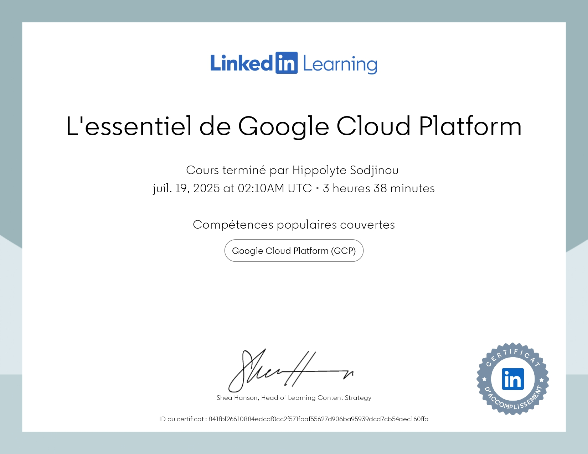
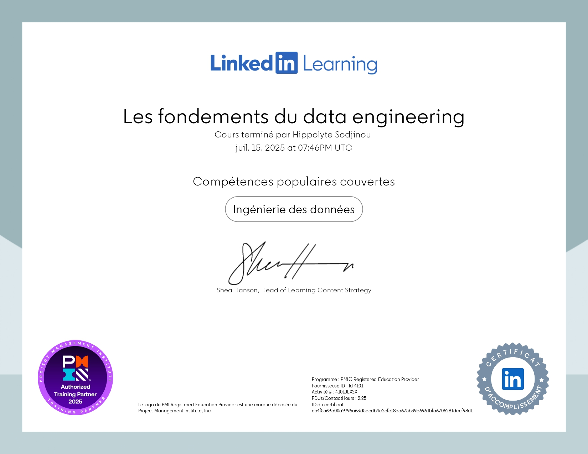

<table>
  <tr>
    <td align="center" width="25%">
      
      
<strong></strong>

    </td>
    <td align="center" width="25%">
      
      
<strong></strong>

    </td>
    <td align="center" width="25%">
      
      
<strong></strong>L'analyse marketing : les indicateurs clés de performance (KPI)

    </td>
    <td align="center" width="25%">
      
      
<strong><a href="https://www.linkedin.com/learning/certificates/d66aaf6d3dacc8f5ff914de492494716ee7a2c2b395a1c78e10037f0bdafea33?trk=share_certificate">L'essentiel de Vertex AI </a></strong>

    </td>
  </tr>
</table>

<table>
  <tr>
    <td align="center" width="25%">
      
      
<strong><a href="https://coursera.org/share/89720c57426a110667ed91cc67fba512"> Smart Analytics, Machine Learning, and AI on
 Google Cloud</a></strong>

    </td>
    <td align="center" width="25%">
      
      
<strong><a href="https://coursera.org/share/921d1f566858388f72ece391ed64f5d4"> Building Resilient Streaming Analytics Systems on
 Google Cloud</a></strong>

    </td>
    <td align="center" width="25%">
      
      
<strong><a href="https://coursera.org/share/62abe59dd660a0603fd2f80ee2fec412">Building Batch Data Pipelines on Google Cloud</a></strong>

    </td>
    <td align="center" width="25%">
      
      
<strong><a href="https://coursera.org/share/0f97792d8cb61e650167a4900345f4dd">Modernizing Data Lakes and Data Warehouses with Google Cloud</a></strong>

    </td>
  </tr>
</table>

<table>
  <tr>
    <td align="center" width="25%">
      
      
<strong><a href="https://www.linkedin.com/learning/certificates/841fbf26610884edcdf0cc2f571faaf55627d906ba95939dcd7cb54aec160ffa?trk=share_certificate">L'essentiel de Google Cloud Platform</a></strong>

    </td>
    <td align="center" width="25%">
      
      
<strong> <a href="https://www.linkedin.com/learning/certificates/cb4f5569a00a9796a63d5acdb4c2cfc18da675b39d6961bfa6706281dccf98d1?trk=share_certificate">Les fondements du data engineering</a></strong>

    </td>
    <td align="center" width="25%">
      
      
<strong><a href="https://www.udemy.com/certificate/UC-0fe51c35-a3d3-4c5e-9391-85f4667badf4/">LLM Engineering: Master AI, Large Language Models & Agents</a></strong>

    </td>
    <td align="center" width="25%">
      
      
<strong><a href="https://www.linkedin.com/learning/certificates/11cea759cfb56cf4a869aedf1f6d67e74f4576fb85e3ecaffa23c013d37912f7?lipi=urn%3Ali%3Apage%3Ad_flagship3_profile_view_base_certifications_details%3BB3zQ%2BuoQRqKEeu5lEcfstA%3D%3D">Les fondements de la finance</a></strong>

    </td>
  </tr>
</table>

<table>
  <tr>
    <td align="center" width="25%">
      
      
<strong><a href="https://www.linkedin.com/learning/certificates/a5943820c0b30ad59280051dcf6751ff8c3f88d0e3006d21d6de26ce8e819022">Dataiku pour le machine learning</a></strong>

    </td>
    <td align="center" width="25%">
      
      
<strong><a href="https://www.linkedin.com/learning/certificates/ceabeaf2a50832bded0d55fa4ab8054370384d3a33e6a58f4592ed8c4d41c89e">Préparer votre carrière dans l'IA générative par Microsoft et LinkedIn</a></strong>

    </td>
    <td align="center" width="25%">
      
      
<strong><a href="https://www.linkedin.com/learning/certificates/40b48c4978252138b1a55333d2fb0a5023db9f9a3038a9780dda25162887bf39">Prompt engineering pour la génération de contenu avec l'IA </a></strong>

    </td>
    <td align="center" width="25%">
      
      
<strong><a href="https://www.linkedin.com/learning/certificates/1ce885039000e5de153b1cb5c6415768042bdd43279002c964790a9485ca74fe">Apprendre l'analyse des données : 1 Fondements</a></strong>

    </td>
  </tr>
</table>
